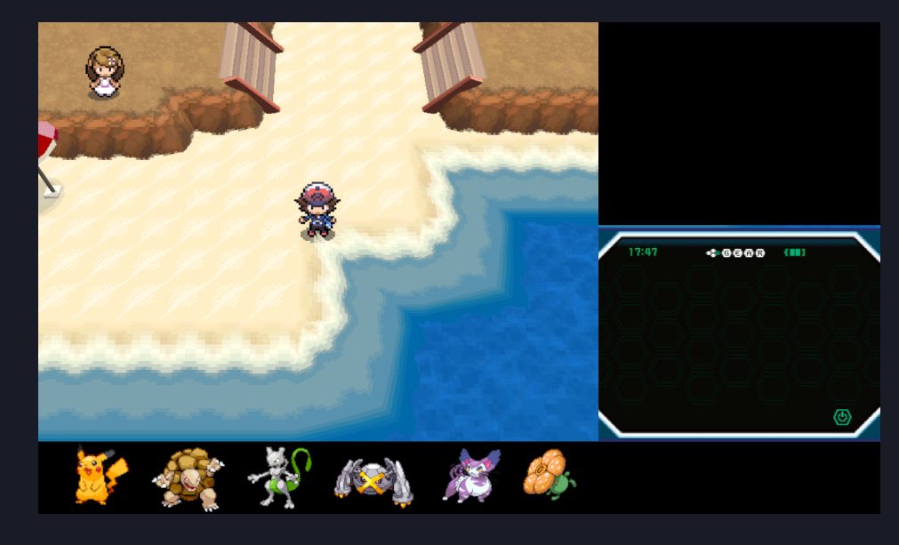
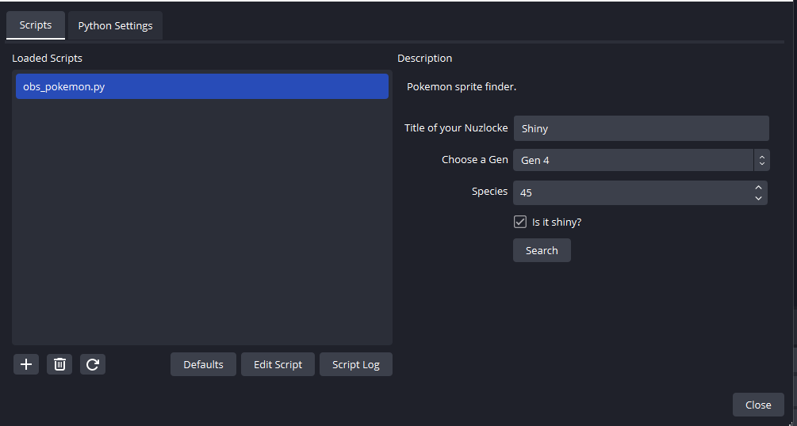

# OBS Poke Stream


## Can be used in 


 - **Regular Pokemon Game**
 - **Pokémon Nuzlocke**  


## Screenshots

<br/>



<br/>



 ## How to use?

**Step 1 Download Python 3.6**

<br/>

**For WIndows**

- Visit the Python Downloads Page for Windows:
        Go to the official Python website's download section at https://www.python.org/downloads/windows/.

- Locate Python 3.6:
        Scroll down until you find Python 3.6. There might be several versions of 3.6.x. Choose the one you prefer or the latest within the 3.6 series.

- Download the Installer:
        Based on your Windows system type, download the appropriate installer:
            For 64-bit systems, download the "Windows x86-64 executable installer".
            For 32-bit systems, download the "Windows x86 executable installer".

- Run the Installer:
        Locate the installer you just downloaded and double-click to run it.
        Ensure you check the box that says "Add Python 3.6 to PATH" during the installation. This makes it easier to run Python from the command line.
        Choose "Install Now" to install Python with default settings, or "Customize installation" if you have specific preferences.

- Verify the Installation:
        After the installation, open the command prompt and type python --version. You should see Python 3.6.x as the output, confirming that Python 3.6 was installed successfully.

<br/>

**For macOS:**

- Visit the Python Downloads Page for macOS:
        Go to https://www.python.org/downloads/mac-osx/.

- Locate Python 3.6:
        Find the Python 3.6.x release.

- Download the Installer:
        Click on the "macOS 64-bit/32-bit installer" link to download the installer for Python 3.6.

- Run the Installer:
        Once downloaded, locate the installer file (usually in the Downloads folder) and double-click on it to run.

- Verify the Installation:
        After the installation, open Terminal and type python3.6 --version. You should get an output indicating the version is Python 3.6.x.

<br/>

**For Linux:**

The method to install Python 3.6 on Linux varies by distribution. Most modern distributions have Python 3.6 or newer available in their package repositories. Here's a general approach for Ubuntu:

Open Terminal.

Update package list:

```
sudo apt update
```

Install Python 3.6:

```
sudo apt install python3.6
```


Verify Installation:


```
python3.6 --version
```
<br/>

**Step 2 Load obs_pokemon.py in OBS Studio**

Open OBS: Launch OBS on your computer.

- Access the Scripts Menu:
        Click on Tools in the top menu.
        From the dropdown, select Scripts.

- Load a Script:
        In the Scripts window, you'll see a list of currently loaded scripts (if any).
        Click on the + button at the bottom left of this window. This will open a file browser dialog.
        Navigate to the location of your script, select it, and then click Open to load it into OBS.
 
 <br/>

**Step 3 Install dependencies of poke_api.py**

The api must have the following packages to run Flask and requests

- Open terminal and go to the directory where teh **requirements.txt** is located
- Run
   ```
   pip install -r requirements.txt
   ```

<br/>

 **Step 4 Run poke_api.py**

The api uses the official pokemon api to grab the sprites.

https://pokeapi.co/

- Open terminal and go to the directory where the **poke_api.py** is located
- Run
   ```
   python poke_api.py
   ```
- You can also use poke_api_simple to use Pokemon original image or Pokemon Go 3d images instead
- Run
  ```
  python poke_api_simple.py
  ```


<br/>


